# savings_accounts
This repository for managing customers accounts. The application runs on Ethereum-compatible block chains and it will automate and it automats institutions finacial process and feature like hosting joint savings account through the use of smart contracts

# Savings Account Application: new application 

This is a tool that helps in firms automate creation of joint savings account. It is writen in Solidity language for smart contracts.
 

The current project is the inital design and development of the application to get MVP that can be tested on the current market cycle.

---

## Technologies


*[Jupyter](https://jupyter.org/documentation) - For documentation

*[Blockchain](https://web3py.readthedocs.io/en/stable/overview.html) For Ethereum based blockchain documentation

*[browser based solidity development and testing environment](https://remix.ethereum.org/) Remix IDE

---

## Installation Guide

Before running the application first install the following dependencies.

```python
  pip install jupyterlab  
  pip install web3==5.17
  pip install eth-tester==0.5.0b3
  pip install mnemonic
  pip install bip44  
     
    
```
*[Install Ganache](https://www.trufflesuite.com/ganache) - Download and install the Latest Version of Ganache

---

## Usage

[joint_savings.sol](https://colab.research.google.com/github/odhissm/trading_bot/blob/main/bot_app/GC_machine_learning_trading_bot.ipynb) - Please upload the file joint_savings.sol from github onto Remix IDE. 

1) Compile the file
2) then deploy the file 


---

## Local Transaction output

Ganached address 1 and 2 used


use application function to set account address 1 and 2
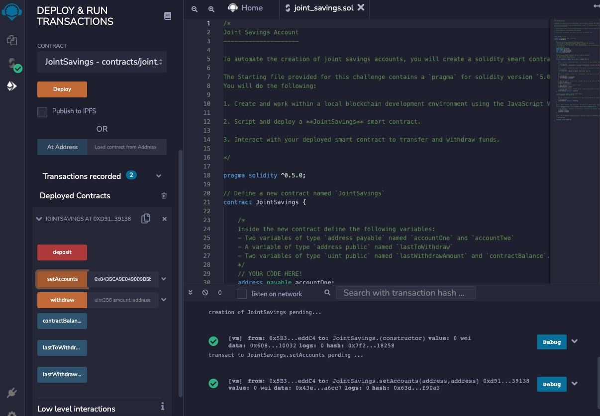


1 a) Transaction 1a: Sending/ depositing 1 Ether as Wei 
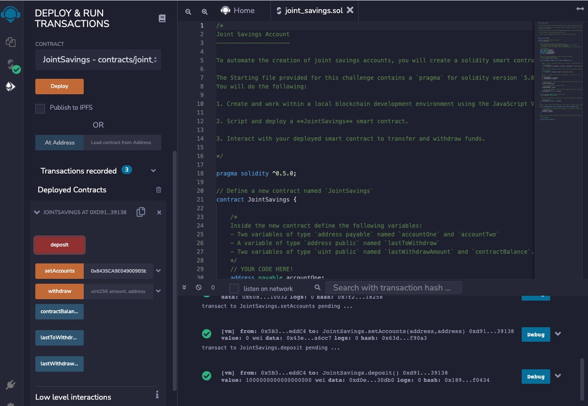


1 b) Transaction 1b: use contractBalance function to check the balance
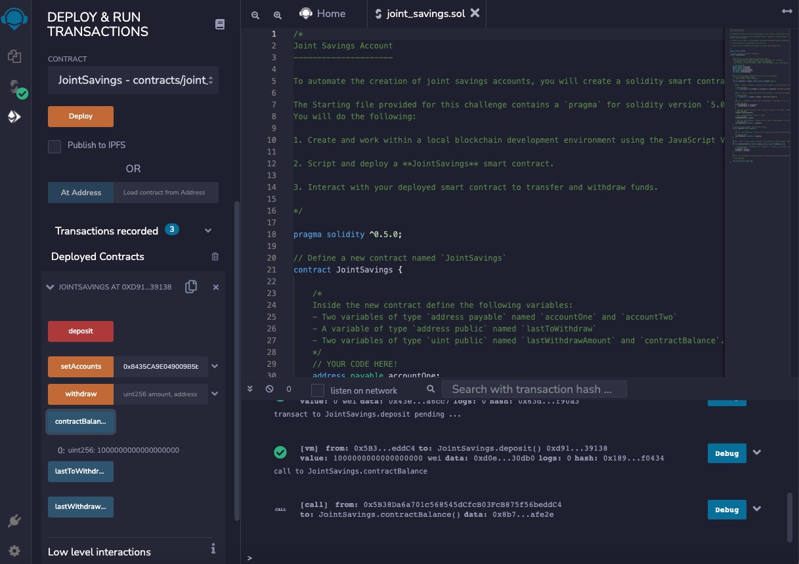


2 a) Transaction 2a: Sending/ depositing 10 Ether as Wei
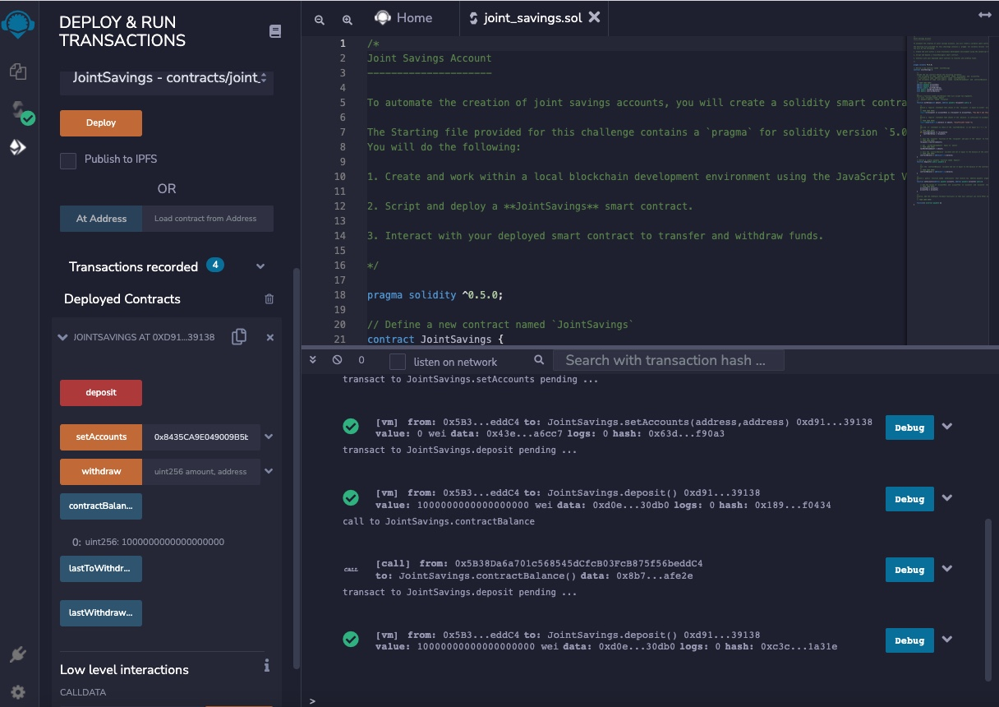


2 b) Transaction 2b: use contractBalance function to check the balance
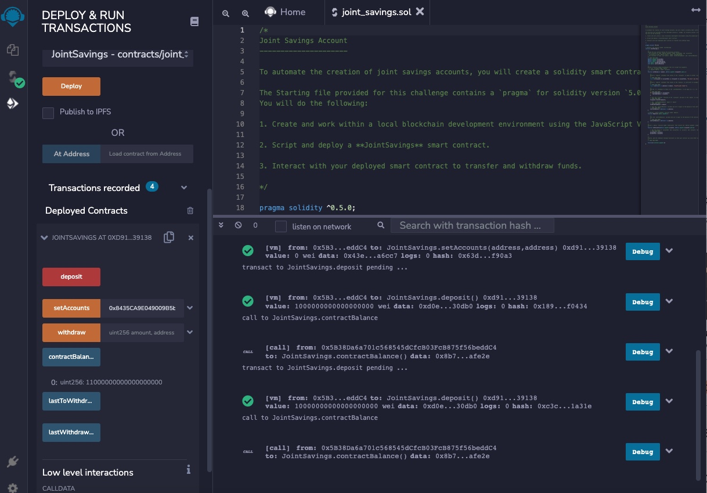


3 a) Transaction 3a: Sending/ depositing 5 Ether as Wei
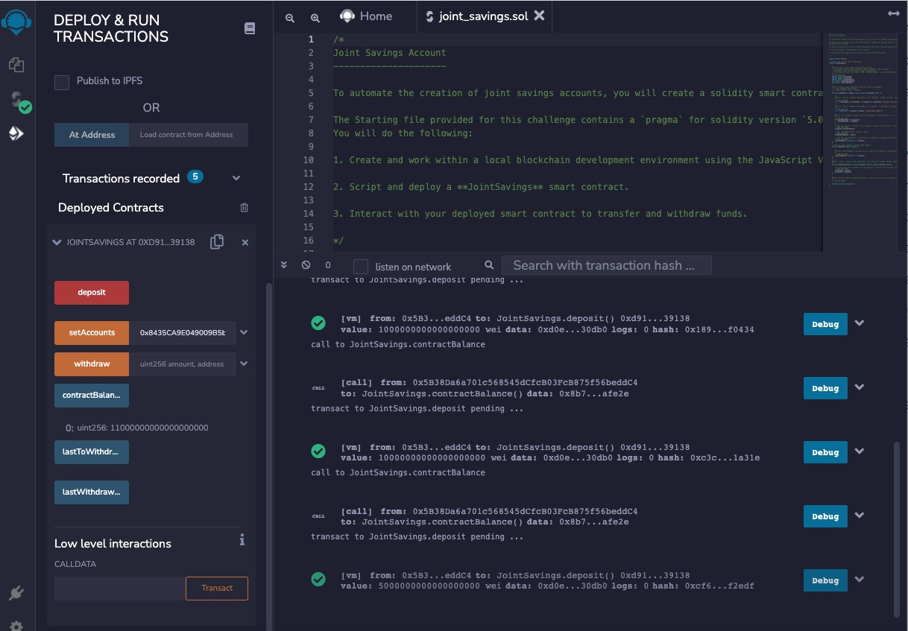


3 b) Transaction 3b: use contractBalance function to check the balance
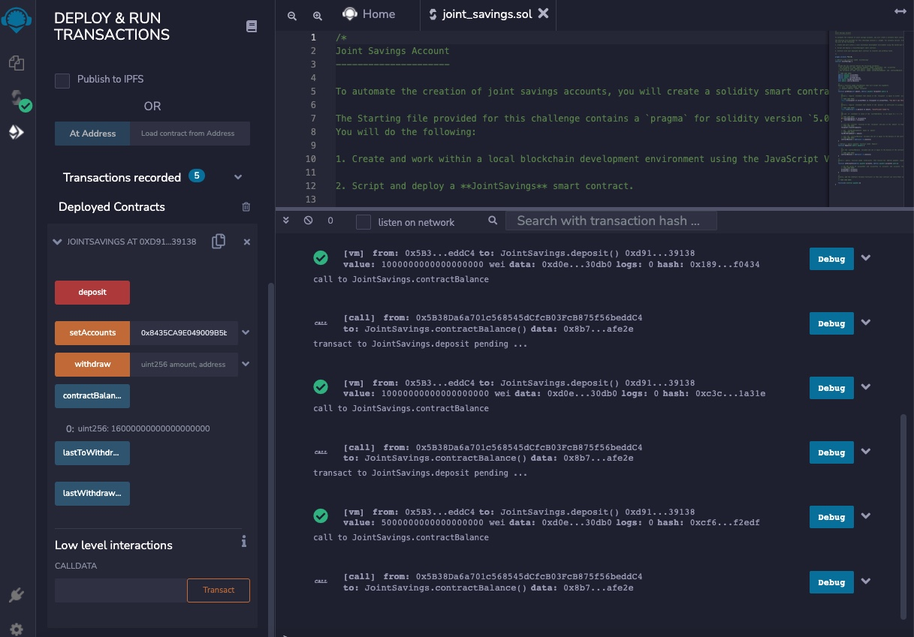


4 a)Transaction 4a: Withdrawing 5 Ether from account 1
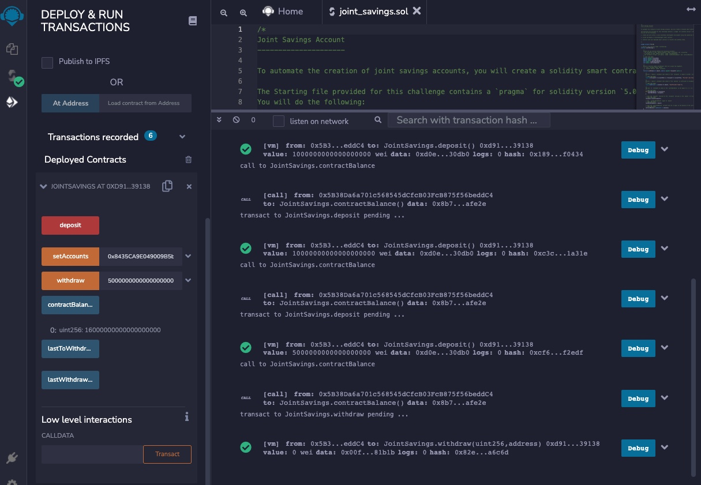


4 b)Transaction 4b: use contractBalance function to check the balance
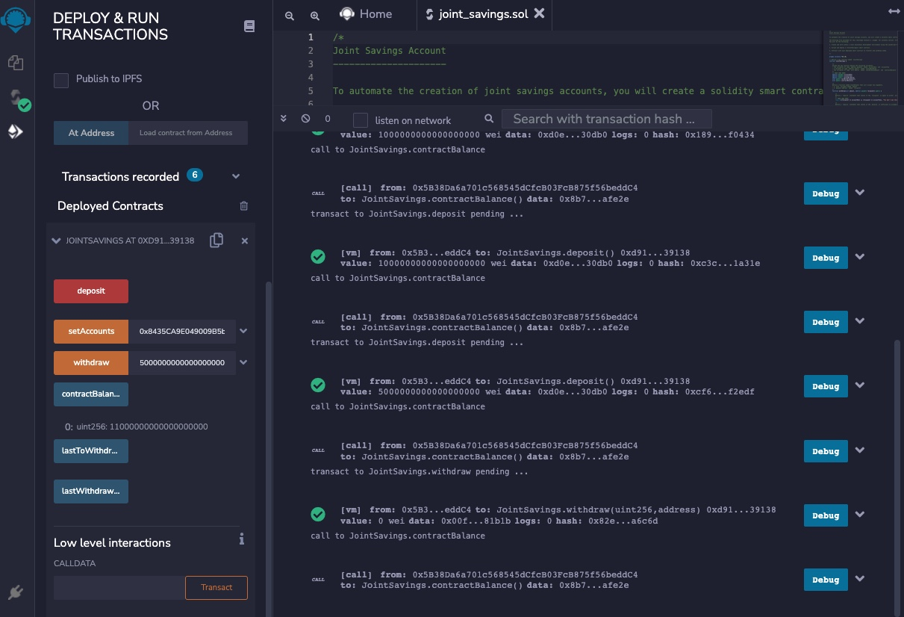


4 c)Transaction 4c: use lastToWithdraw function to check who withdraw last
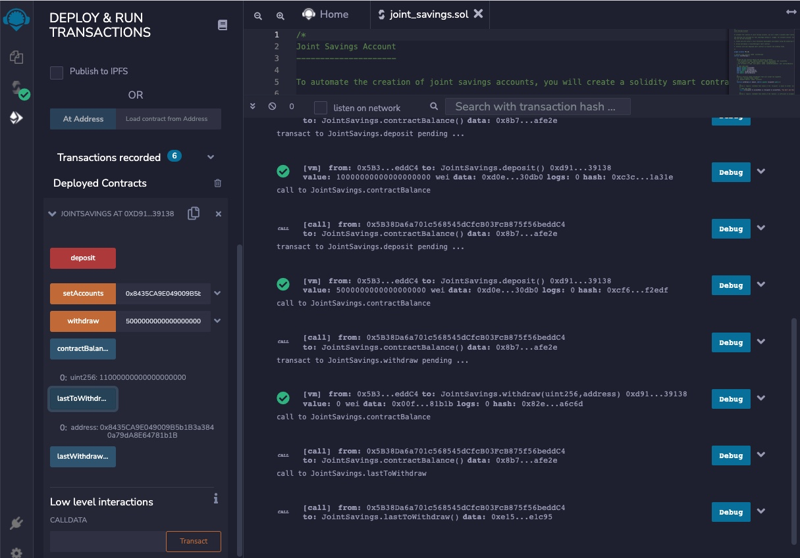


4 d)Transaction 4d: use lastToWithdrawAmount function to check last withdrawal amount
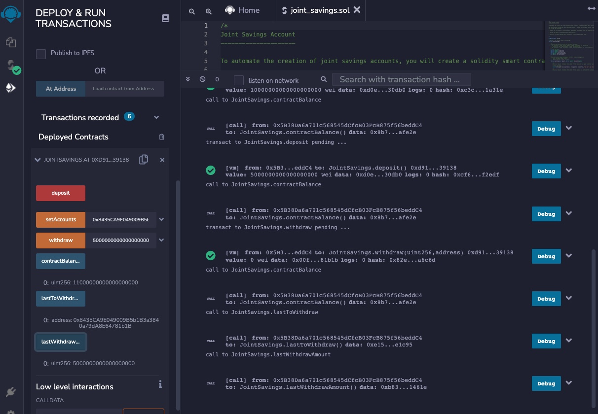


5 a)Transaction 5a: Withdrawing 10 Ether from account 2
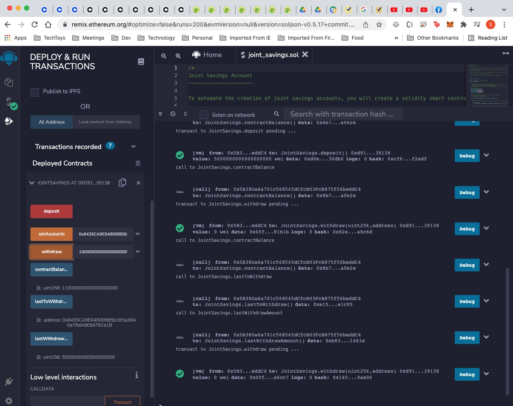


5 b)Transaction 5b: use contractBalance, lastToWithdraw and lastToWithdrawAmount function to check the balance, address and amount respectively
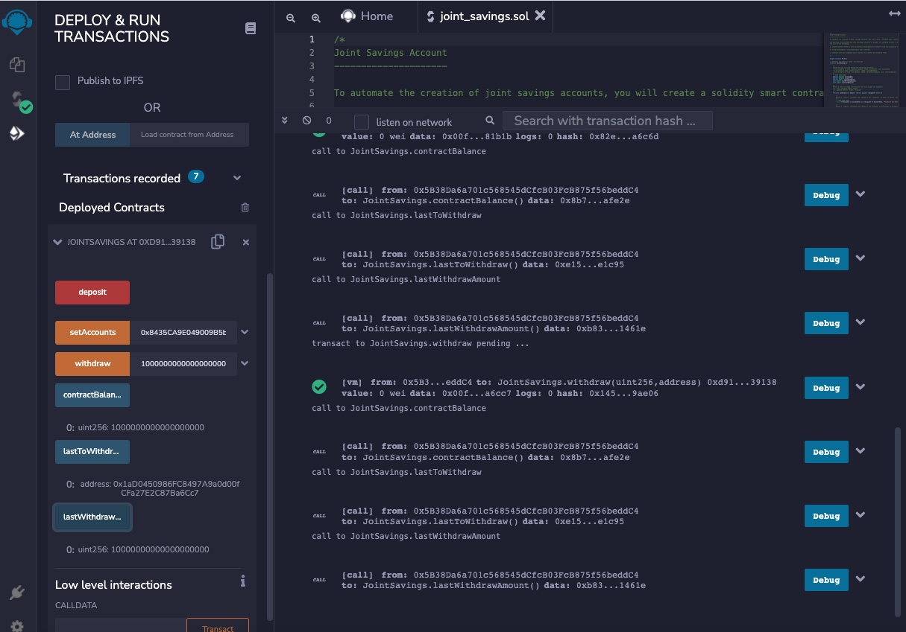


---

## Contributors

Brought to you by odhissm@gmail.com

---

## License

MIT

